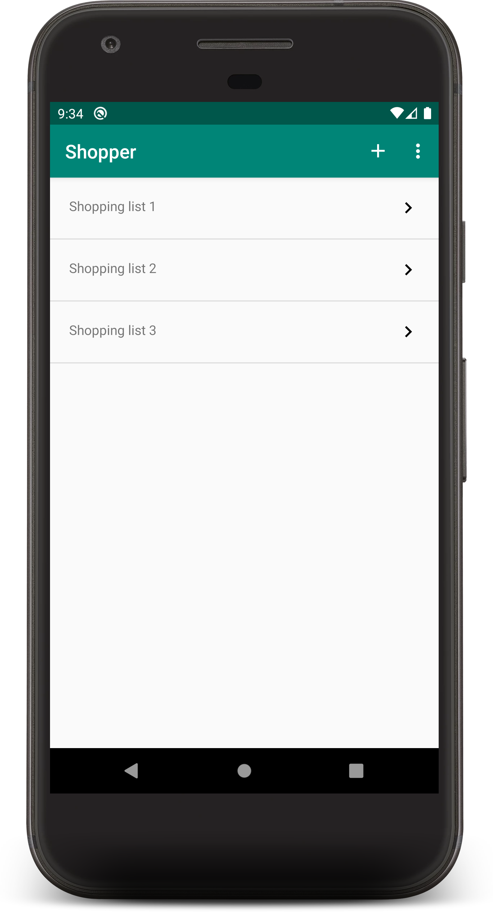
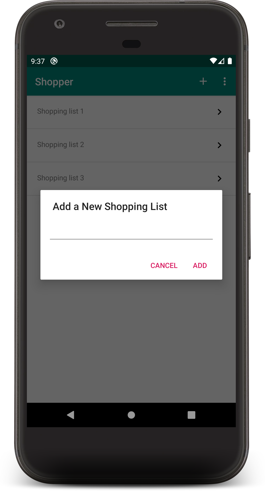
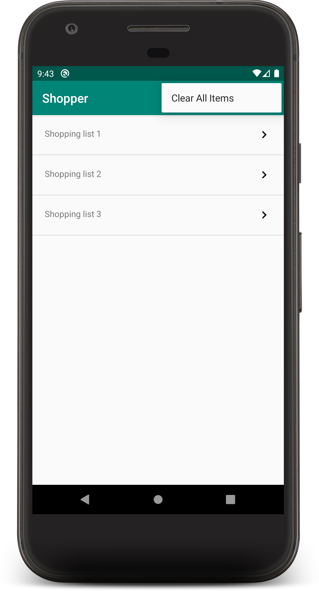
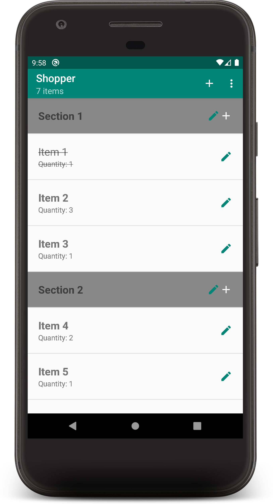
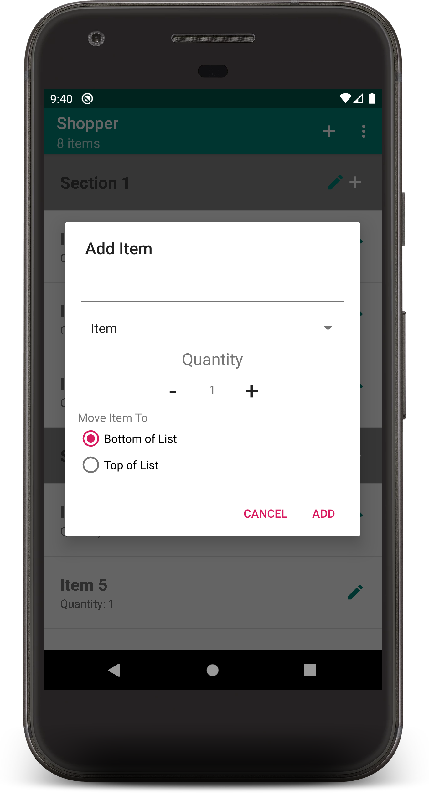
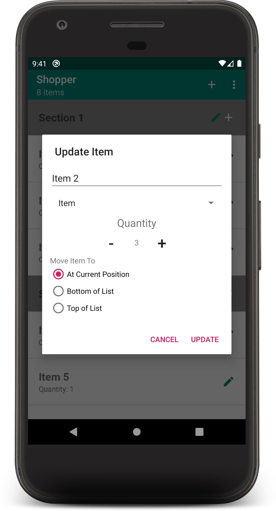
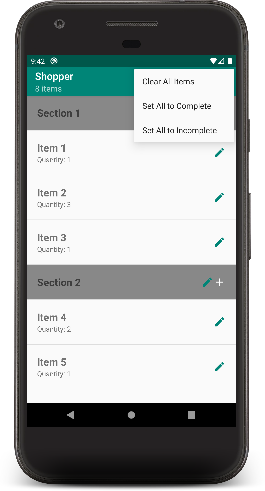

# Shopper
A Shopping list app.

## Basic Features

### Shopping List View
The main view is a list of the user's shopping lists:

The user can select any of these lists to view the items in them.

The user can select `+` to add shopping lists:

From the extended menu (3 vertical dots) to delete all shopping lists and associated items:

### Shopping List Items View
After selecting a shopping list, the user is presented with a list of items associated with that list:

Users can add items or sections. Items can be added directly to sections.

Users can mark an item as complete (e.g., retrieved from store/shelf) or incomplete (e.g., not yet retrieved from store/shelf). Complete items have the text crossed out, and incomplete items are bold.

Users can add new items and sections:

Users can also edit existing items and sections:

From the extended menu, the user can also delete all items in a shopping list, mark all items as complete, or mark all items as incomplete:

## Testing
### Common Errors
* Animations will impact tests. [Follow the instructions here](https://developer.android.com/studio/debug/dev-options.html) to disable animations on the testing device.
